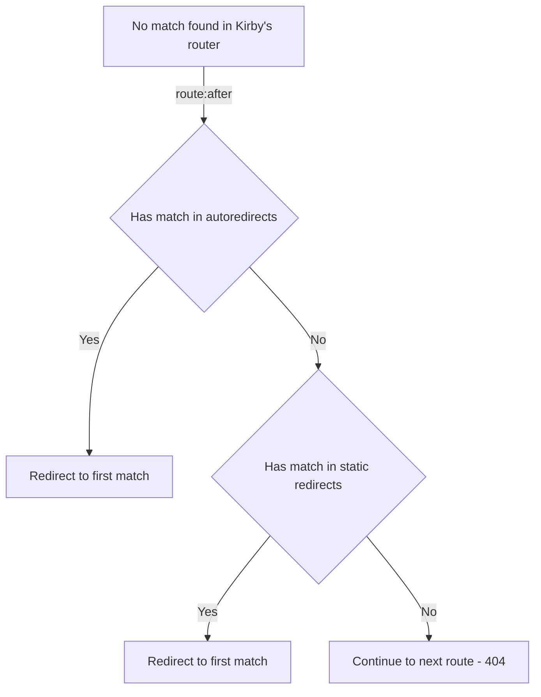

# Kirby Redirects

A Kirby 3 panel plugin to handle redirects in an opinionated way.
This plugin allows you to add redirects manually, as you'ld do via a .htaccess file.
But it also adds functionality that automatically creates redirects when slug changes happen in the panel.

⚠️ _Caveat: Installing this plugin disables changing slugs for pages that have subpages!_

## Installation

- unzip [master.zip](https://github.com/bvdputte/kirby-redirects/archive/master.zip) as folder `site/plugins/kirby-redirects` or
- `git submodule add https://github.com/bvdputte/kirby-redirects.git site/plugins/kirby-redirects` or
- `composer require bvdputte/kirby-redirects`

⚠️ _You'll need at least Kirby 3.8 to use this plugin._

## ...

## Logic diagrams

### Redirect flow




### Configurable options

All of them are optional, below are the defaults.

```php
// in site/config/config.php:

// String. Root of redirectsfile where the manual redirects live
'redirectsFileRoot' => kirby()->root('config') . '/' . 'redirects.json',
// String. Root of redirectsfile where to store the automatically generated redirects
'autoredirectsFileRoot' => kirby()->root('config') . '/' . 'redirects-via-panel.json',
// int. Default redirect HTTP status code
'autoredirectsDefaultCode' => 302
```


## Disclaimer

This plugin is provided "as is" with no guarantee. Use it at your own risk and always test it yourself before using it in a production environment. If you find any issues, please [create a new issue](https://github.com/bvdputte/kirby-redirects/issues/new).

## License

[MIT](https://opensource.org/licenses/MIT)

It is discouraged to use this plugin in any project that promotes racism, sexism, homophobia, animal abuse, violence or any other form of hate speech.

## Inspiration

- [Initial concept and explanation](https://forum.getkirby.com/t/a-minimalist-redirect-solution-that-intercepts-404-errors/24007)
- [Further discussion around redirects](https://github.com/distantnative/retour-for-kirby/issues/169)
