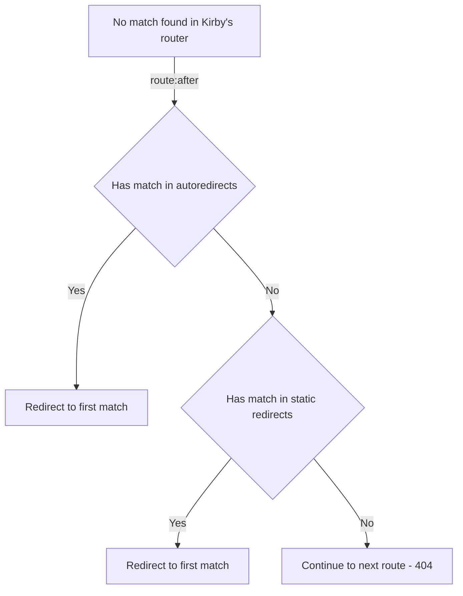
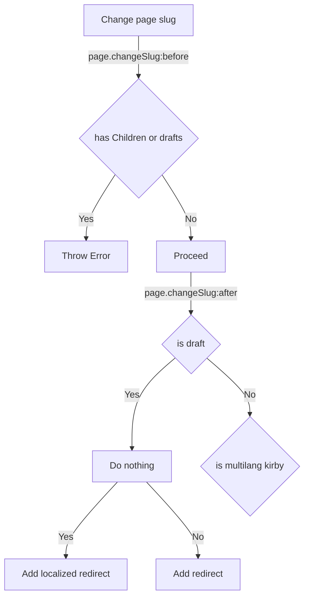
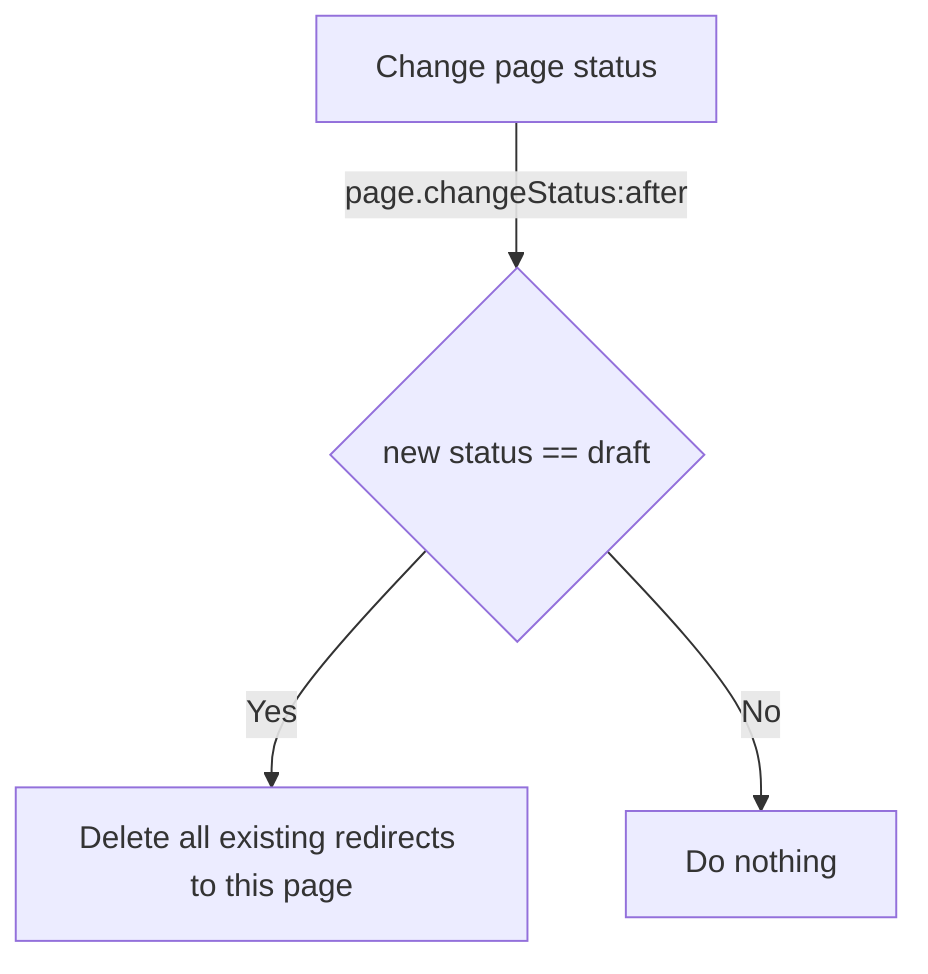
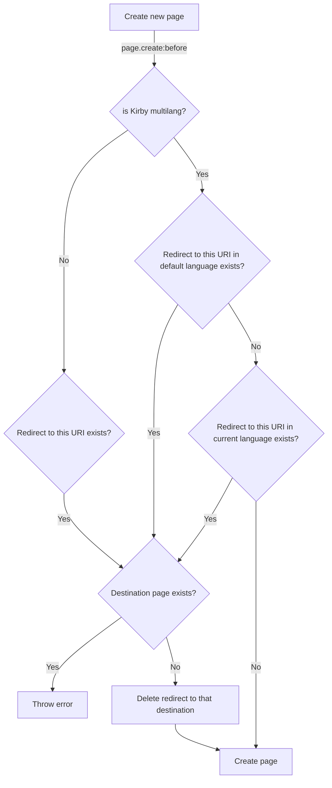
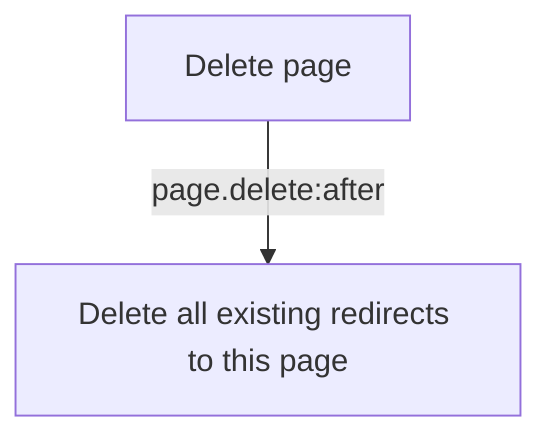

# Kirby Redirects

A Kirby 3 panel plugin to handle redirects in an opinionated way.

It exists out of 2 components:
1. static redirects: this allows you to add redirects manually in a json file, as you'ld do via a .htaccess file. Usually this happens when taking over an existing site, or do large architectural changes. Happens usually by devs/specialists, and are matched via regex.
2. auto redirects: this keeps track of slug changes that happen by editors via the panel. These can be visualised in the panel via the `redirects` field. With this field, editors can also delete generated autoredirects.

**Takeaways**

- Autoredirects store an URI and match that to a page UUID. This way a page can have multiple historic URI's pointing towards it.
- It's multilingual ready. (most of my sites are multilingual -- please test thoroughly on single lang setups)
- It's designed to work in the background, and be an "assistant" for editors. But it also has a manual redirects setup for more experienced users (outside the panel), so all redirects are managed by the same plugin.
- I haven't found a nice way to deal with slug updates for pages with subpages. Installing this plugin disables changing slugs for pages with subpages.
- Moving pages with the [Move pages plugin](https://getkirby.com/plugins/owebstudio/move-pages) will also change slugs. These changes will **not** result in autoredirects.
- Autoredirects are created with the 302 HTTP status code. IMO this is the safest default, since redirects can be removed and recycled for pages.

## Installation

- unzip [master.zip](https://github.com/bvdputte/kirby-redirects/archive/master.zip) as folder `site/plugins/kirby-redirects` or
- `git submodule add https://github.com/bvdputte/kirby-redirects.git site/plugins/kirby-redirects` or
- `composer require bvdputte/kirby-redirects`

⚠️ _You'll need at least Kirby 3.8 to use this plugin._

### Setup

#### Autoredirects

Autoredirects are immediately active and will start recording slug changes. By default these will be stored in the `autoredirects.json` file in `site/config`.

##### Redirects field

Add the redirects field to the blueprints like this:

```
autoredirects:
  type: redirects
  label: Redirects
```


#### Manual redirects

Manual redirects can be added in `site/config/redirects.json` as a json array, e.g.:

```json
[
  [
    "^en/photography-old/(.*?)$",
    "en/photography/$1",
    302
  ],
  [
    "^en/notes-old/(.*?)$",
    "en/notes",
    302
  ]
]
```

## Logic diagrams

### Redirect flow



### Hooks

#### Change page slug



#### Change page status



#### Create page



#### Delete page



### Configurable options

All of them are optional, below are the defaults.

```php
// in site/config/config.php:

// String. Root of redirectsfile where the manual redirects live
'redirectsFileRoot' => kirby()->root('config') . '/' . 'redirects.json',
// String. Root of redirectsfile where to store the automatically generated redirects
'autoredirectsFileRoot' => kirby()->root('config') . '/' . 'autoredirects.json',
// int. Default redirect HTTP status code
'autoredirectsDefaultCode' => 302
```


## Disclaimer

This plugin is provided "as is" with no guarantee. Use it at your own risk and always test it yourself before using it in a production environment. If you find any issues, please [create a new issue](https://github.com/bvdputte/kirby-redirects/issues/new).

## License

[MIT](https://opensource.org/licenses/MIT)

It is discouraged to use this plugin in any project that promotes racism, sexism, homophobia, animal abuse, violence or any other form of hate speech.

## Inspiration

- [Initial concept and explanation](https://forum.getkirby.com/t/a-minimalist-redirect-solution-that-intercepts-404-errors/24007)
- [Further discussion around redirects](https://github.com/distantnative/retour-for-kirby/issues/169)
